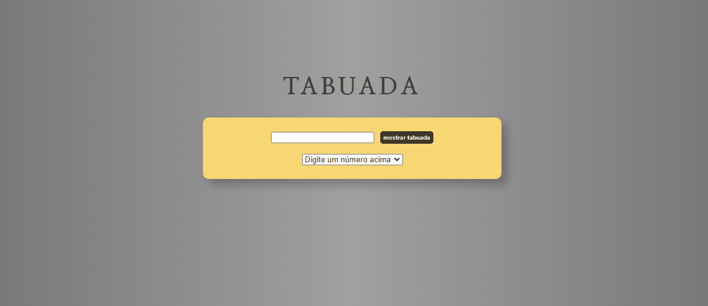
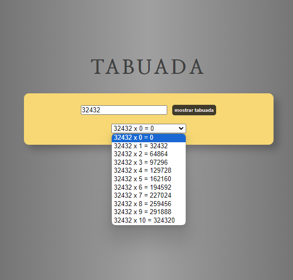

# Tabuada

O projeto se trata de uma tabuada. Colocando qualquer número no input e apertando no botão ao lado, mostrará a tabuada do respectivo número do 0 ao 10. Utilizando JavaScript como ferramenta.

## Menu

- [Screenshot](#screenshot)
- [Links](#links)
- [Feito com](#feito-com)
- [o que aprendi](#o-que-aprendi)
- [Autor](#autor)
- [Contato](#contato)

### Screenshot

### Links

- Site do projeto: [Projeto](https://bruno-nog.github.io/contador/)

### Feito com:

- HTML5
- CSS3
- JavaScript

### O que aprendi

A Tabuada foi feito com o objetivo de praticar JS, sua estrutura e estilização é simples, pois o foco foi o JS. Dado o número, o programa passa o próprio para um laço e multiplica esse número dado pelo usuário de 0 até 10. 

## Autor

- Frontend Mentor - [@Bruno-nog](https://www.frontendmentor.io/profile/Bruno-nog)

## Contato

